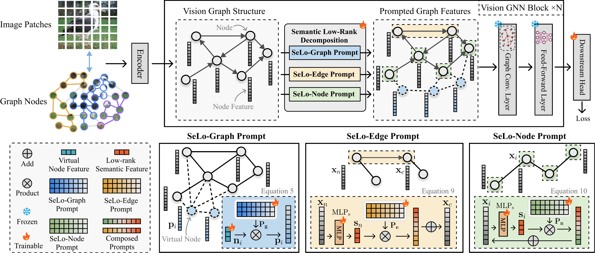
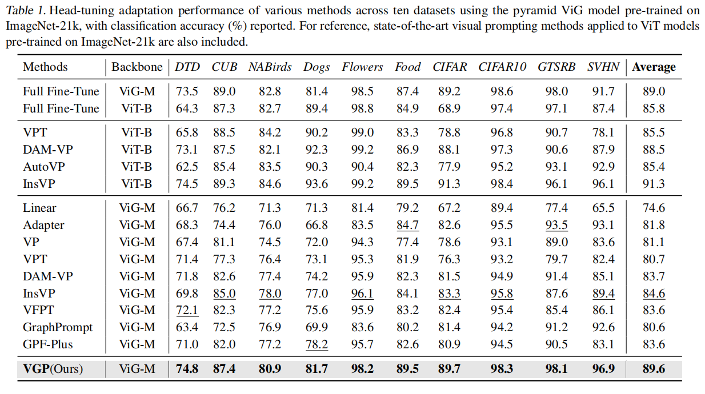
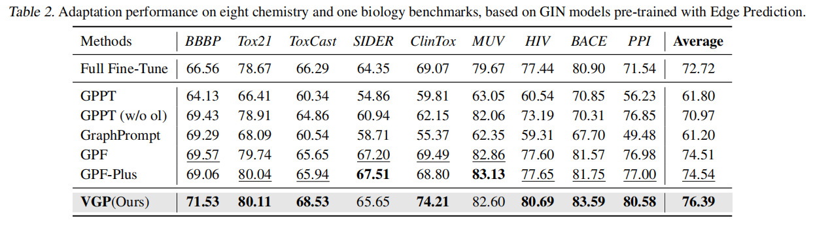

# Vision Graph Prompting via Semantic Low-Rank Decomposition
<div align="center">
    Zixiang Ai<sup>1</sup>&emsp; Zichen Liu<sup>1</sup>&emsp; Jiahuan Zhou<sup>†</sup><sup>1</sup> <br>
    <small>
    <sup>1 Wangxuan Institute of Computer Technology, Peking University&emsp; <br></sup>
    </small>
</div>

<p align="center">
  <a href='https://arxiv.org/abs/2505.04121'></a>
  <a href="https://github.com/zhoujiahuan1991/ICML2025-VGP"></a>
</p>

<div align="center">
Official implementation of 'Vision Graph Prompting via Semantic Low-Rank Decomposition'.


The paper has been accepted by **ICML 2025**.
</div>


<p align="center"></p>
Vision GNN (ViG) demonstrates superior performance by representing images as graph structures, providing a more natural way to capture irregular semantic patterns beyond traditional grid or sequence-based representations. To efficiently adapt ViG to downstream tasks, parameter-efficient fine-tuning techniques like visual prompting become increasingly essential. However, existing prompting methods are primarily designed for Transformer-based models, neglecting the rich topological relationships among nodes and edges in graph-based representations, limiting their capacity to model complex semantics. In this paper, we propose Vision Graph Prompting (VGP), a novel framework tailored for vision graph structures. Our core insight reveals that semantically connected components in the graph exhibit low-rank properties. 

Building on this observation, we introduce a semantic low-rank prompting method that decomposes low-rank semantic features and integrates them with prompts on vision graph topologies, capturing both global structural patterns and fine-grained semantic dependencies. 
Extensive experiments demonstrate our method significantly improves ViG’s transfer performance on diverse downstream tasks, achieving results comparable to full fine-tuning while maintaining parameter efficiency. 


<p align="center"></p>
 The center patch (red star) is randomly selected from the primary semantic region, with neighboring patches (blue dot) linked via edges. PCA is applied to patches from the same image group (a, b), mapping the first three components to the RGB color channels. Despite variations in shape, texture, and color, the ViG graph effectively connects semantically related object parts. These connected regions share common principal components, demonstrating a low-rank structure. Background regions are filtered out by thresholding the first principal component.


## Main Results
Head-tuning adaptation performance of various methods across ten datasets using the pyramid ViG model pre-trained on ImageNet-21k, with classification accuracy (%) reported. For reference, state-of-the-art visual prompting methods applied to ViT models pre-trained on ImageNet-21k are also included. 
<p align="center"></p>


Adaptation performance on eight chemistry and one biology benchmarks, based on GIN models pre-trained with Edge Prediction.
<p align="center"></p>


## Checkpoint Release
The pre-trained backbones are provided below. In our main result table, the pyramid Vision GNN model with medium size pre-trained on ImageNet-21k is adopted. 

- ViG

| Model  | Pre-train   | Params (M) | FLOPs (B) | Top-1 | Github Release                                               |
| ------ | ----------- | ---------- | --------- | ----- | ------------------------------------------------------------ |
| ViG-Ti | ImageNet-1k | 7.1        | 1.3       | 73.9  | [Github Release](https://github.com/huawei-noah/Efficient-AI-Backbones/releases/tag/vig) |
| ViG-S  | ImageNet-1k | 22.7       | 4.5       | 80.4  | [Github Release](https://github.com/huawei-noah/Efficient-AI-Backbones/releases/tag/vig) |
| ViG-B  | ImageNet-1k | 86.8       | 17.7      | 82.3  | [Github Release](https://github.com/huawei-noah/Efficient-AI-Backbones/releases/tag/vig) |

- Pyramid ViG

| Model             |    Pre-train     | Params (M) | FLOPs (B) | Top-1 | Github Release                                               |
| ----------------- | :--------------: | ---------- | --------- | ----- | ------------------------------------------------------------ |
| Pyramid ViG-Ti    |   ImageNet-1k    | 10.7       | 1.7       | 78.5  | [Github Release](https://github.com/huawei-noah/Efficient-AI-Backbones/releases/tag/pyramid-vig) |
| Pyramid ViG-S     |   ImageNet-1k    | 27.3       | 4.6       | 82.1  | [Github Release](https://github.com/huawei-noah/Efficient-AI-Backbones/releases/tag/pyramid-vig) |
| Pyramid ViG-M     |   ImageNet-1k    | 51.7       | 8.9       | 83.1  | [Github Release](https://github.com/huawei-noah/Efficient-AI-Backbones/releases/tag/pyramid-vig) |
| Pyramid ViG-B     |   ImageNet-1k    | 82.6       | 16.8      | 83.7  | [Github Release](https://github.com/huawei-noah/Efficient-AI-Backbones/releases/tag/pyramid-vig) |
| **Pyramid ViG-M** | **ImageNet-21k** | 51.7       | 8.9       | -     | [Github Release](https://github.com/huawei-noah/Efficient-AI-Backbones/releases/download/pyramid-vig/pvig_m_im21k_90e.pth) |


## Environment
Create a conda environment and install basic dependencies:
```bash
git clone git@github.com:zhoujiahuan1991/ICML2025-VGP.git
cd ICML2025-VGP

# Not necessary
conda create -n vgp python=3.9
conda activate vgp

# Install the corresponding versions of Torch and TorchVision; other compatible versions are also acceptable.
pip install torch==1.13.1+cu116 torchvision==0.14.1+cu116 --extra-index-url https://download.pytorch.org/whl/cu116

pip install -r requirements.txt
```

## Dataset
We conduct vision adaptation tasks on ten different datasets, following [DAM-VP](https://github.com/shikiw/DAM-VP).
The CUB, Birds, Dogs, and Flowers can be downloaded in VPT repo, while the other datasets can be accessed through torchvision.

To prepare the datasets of Visual Task Adaptation Benchmark (VTAB) benchmark, you can install the tensorflow package as in VPT repo and run the command below:
```bash
python data_utils/vtab_prep.py
```
The overall directory structure should be:

```
data
├── cifar-100-python
├── cifar-10-batches-py
├── CUB_200_2011
├── dtd
├── flowers102
├── food101
├── gtsrb
├── nabirds
├── StanfordCars
├── stanford_dogs
└── SVHN
```

## Parameter-efficient Fine-tuning
For the ten vision adaptation datasets, the same hyperparameters are utilized.
```bash
# cifar100 
python main.py --data_dir ./data --dataset cifar100 --exp_name check --model pvig_lor_gp_m_224_gelu --pretrain_path pretrained_bases/pvig_m_im21k_90e.pth --lr 0.0010 --pretrained --peft

# cifar10
python main.py --data_dir ./data --dataset cifar10 --exp_name check --model pvig_lor_gp_m_224_gelu --pretrain_path pretrained_bases/pvig_m_im21k_90e.pth --lr 0.0010 --pretrained --peft

# dtd47 
python main.py --data_dir ./data --dataset dtd47 --exp_name check --model pvig_lor_gp_m_224_gelu --pretrain_path pretrained_bases/pvig_m_im21k_90e.pth --lr 0.0010 --pretrained --peft

# food101
python main.py --data_dir ./data --dataset food101 --exp_name check --model pvig_lor_gp_m_224_gelu --pretrain_path pretrained_bases/pvig_m_im21k_90e.pth --lr 0.0010 --pretrained --peft

# cub200
python main.py --data_dir ./data --dataset cub200 --exp_name check --model pvig_lor_gp_m_224_gelu --pretrain_path pretrained_bases/pvig_m_im21k_90e.pth --lr 0.0010 --pretrained --peft

# stanford_dogs120
python main.py --data_dir ./data --dataset stanford_dogs120 --exp_name check --model pvig_lor_gp_m_224_gelu --pretrain_path pretrained_bases/pvig_m_im21k_90e.pth --lr 0.0010 --pretrained --peft

# nabirds1011
python main.py --data_dir ./data --dataset nabirds1011 --exp_name check --model pvig_lor_gp_m_224_gelu --pretrain_path pretrained_bases/pvig_m_im21k_90e.pth --lr 0.0010 --pretrained --peft

# flowers102
python main.py --data_dir ./data --dataset flowers102 --exp_name check --model pvig_lor_gp_m_224_gelu --pretrain_path pretrained_bases/pvig_m_im21k_90e.pth --lr 0.0010 --pretrained --peft

# gtsrb43 
python main.py --data_dir ./data --dataset gtsrb43 --exp_name check --model pvig_lor_gp_m_224_gelu --pretrain_path pretrained_bases/pvig_m_im21k_90e.pth --lr 0.0010 --pretrained --peft

# svhn10
python main.py --data_dir ./data --dataset svhn10 --exp_name check --model pvig_lor_gp_m_224_gelu --pretrain_path pretrained_bases/pvig_m_im21k_90e.pth --lr 0.0010 --pretrained --peft

```


## Citation
If you find our paper and code useful in your research, please consider giving a star and citation.
```bash
@inproceedings{ai2025vgp,
  title={Vision Graph Prompting via Semantic Low-Rank Decomposition},
  author={Ai, Zixiang and Liu, Zichen and Zhou, Jiahuan},
  booktitle={International Conference on Machine Learning},
  year={2025}
}
```

## Acknowledgement
This repo benefits from [DeepGCN](https://github.com/lightaime/deep_gcns_torch), [VisionGNN](https://github.com/huawei-noah/Efficient-AI-Backbones/tree/master/vig_pytorch), [VPT](https://github.com/KMnP/vpt), and [InsVP](https://github.com/zhoujiahuan1991/MM2024-InsVP). Thanks for their wonderful works.

